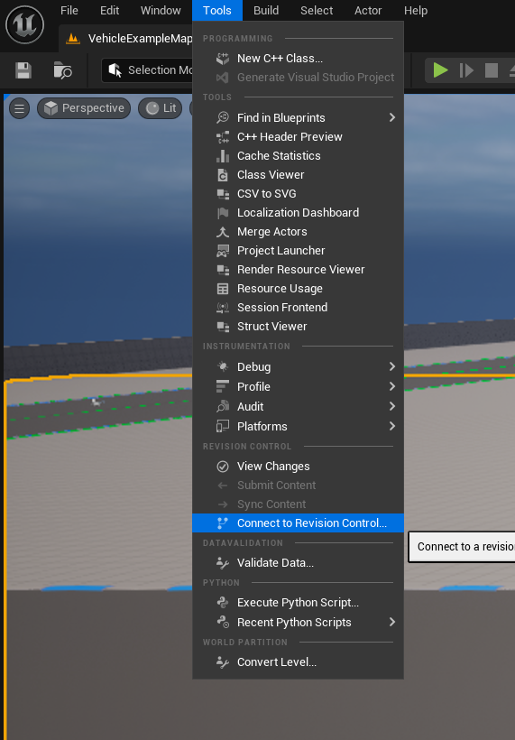
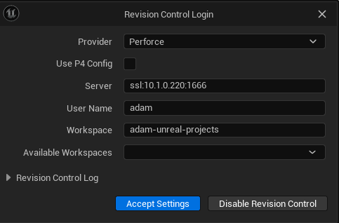
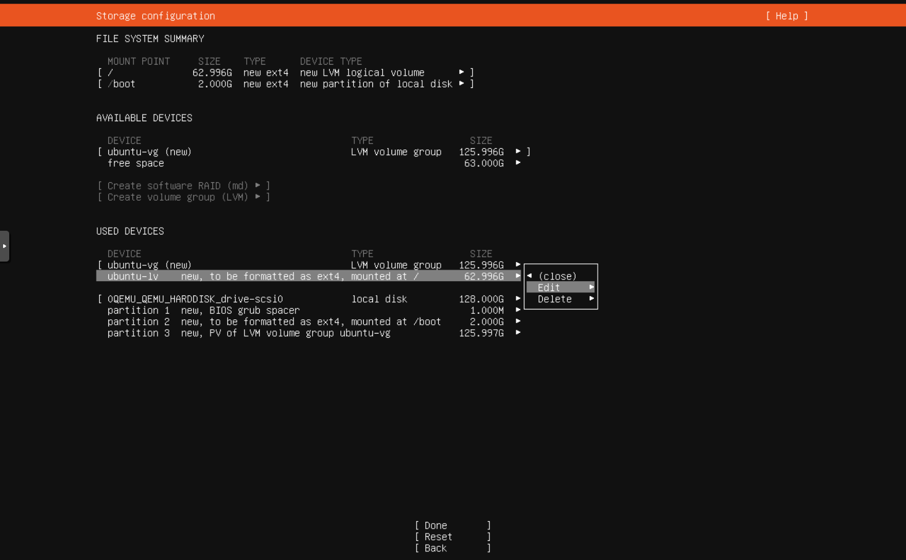
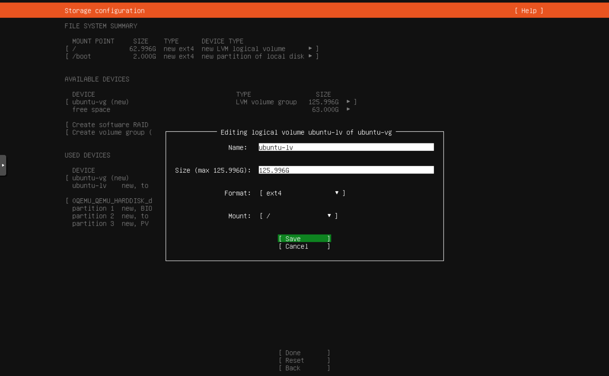

## Server Setup

- LTS version of Ubuntu Server.
    - https://ubuntu.com/download/server

- ISO->USB utility: 
    - https://ventoy.net/en/index.html
    - https://rufus.ie/en/

1. Create a bootable USB drive from your ISO then install Ubuntu.
    - Update to the newest installer when prompted.
    - You'll need to adjust partitioning to use the full disk, see "Partitioning" for tips.
    - Install OpenSSH server if available.
    - You might see a docker option during install, leave it unchecked.

2. Once installed open a console and run `sudo apt update` then `sudo apt upgrade`.
    - See "Remote Access" for some tips.

3. Run `git clone https://github.com/adambauman/service-helpers.git`

4. Run `/service-helpers/docker/install-docker.sh`

5. Run `/service-helpers/docker/perforce-helix-core/setup.sh`
    - During setup you'll be asked to configure p4d. For the most part you can stick with the defaults but these might need to be changed:
        - Server name: "master"
        - Server root: "/perforce-data"
        - Server port: "ssl:1666" NOTE: If you're changing external ports do that in the compose.yaml!
        - Enter a very strong password for the super user

## Client Setup
Unreal Editor includes solid Perforce integration, outside the editor you can use the Helix Visual Client to sync content and manage server 
stuff like your users and groups.

### Install the visual client
Helix Visual Client, Windows EXE version: https://www.perforce.com/downloads/helix-visual-client-p4v

### TODO: p4v setup, user management, and workspace creation

### Prepare for UE integration
Open a command prompt and run:
- `p4 set P4USER=<user_name>`
- `p4 set P4PORT=ssl:<server_ip>:<port_number>`  example: "ssl:10.1.0.220:1666"
- `p4 login`  enter your password

### Connect in UE
1. Open a UE project, click `Tools` and `Connect to Revision Control...`
   

2. Enter your server info, example:
   

## Partitioning
By default the server installer only partitions out what it needs, it's your perogitive if you want to expand the root partition to use the whole 
disk or create additional partitions. Starting out I'd opt to fill the whole disk, especially since we're deploying a micro service and you'll have this
data stored in at least two other locations. 

Use all the default partitioning options until you get to this screen, then select the root partition and hit the `edit` option:

Expand Size to the max value and select `Save`.

## Remote Access
If you plan to setup and maintain remotely from a Windows environment give Powershell a shot.

Install Powershell 7+: https://learn.microsoft.com/en-us/powershell/scripting/install/installing-powershell-on-windows?view=powershell-7.4#msi

Connect to a remote Linux machine (ssh must be enabled on the host): `ssh adam@192.168.1.200`
    - ssh <user_name_on_host>@<host_ip_address>

Transferring files from Windows to remote host: `scp c:/some_files/file.txt adam@192.168.1.200:/home/adam/file.txt`
    - scp <source_path> <user_name_on_host>@<host_ip_address>:<destination_path>, flip the parameters to go the other way.

## References
- These instructions got me started down the right path: https://aricodes.net/posts/perforce-server-with-docker/
